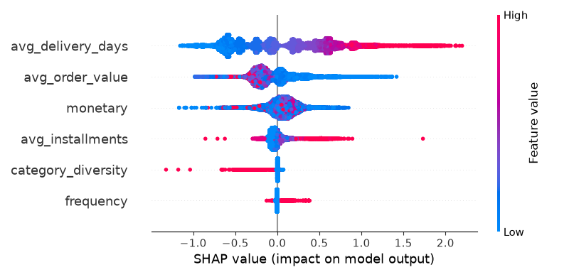

# E-commerce Customer Churn & Revenue Analytics

A full-stack data analytics project built on real e-commerce transaction data — from raw CSVs to a normalized SQL database, analytical SQL views, an explainable churn model, and a deployed interactive dashboard.

**Live dashboard:** https://ecommerce-churn-analytics-jjchuksksfuyhxrydcybrx.streamlit.app/

---

## Business Summary

Using 93K+ real customer records from the Olist Brazilian e-commerce dataset, this project identifies **$10.7M in revenue currently at risk** from predicted customer churn, and traces the primary driver back to a single operational factor: **delivery speed**. SHAP analysis of the churn model shows customers experiencing longer delivery times are substantially more likely to churn — a more actionable finding than "spend more on retention," since it points to a specific, fixable lever.

Cohort analysis further shows the scale of the problem: of ~93,000 customers active in their first month, only **~420 (0.5%) make a repeat purchase in the following month** — retention isn't just weak, it drops off almost immediately after the first order.

---

## Architecture

```
Raw CSVs (Olist dataset)
        │
        ▼
Python ingestion (pandas + SQLAlchemy)
        │
        ▼
MySQL — normalized 5-table schema
(customers, orders, order_items, order_payments, products)
        │
        ▼
SQL analytics layer (views)
  • customer_rfm — Recency/Frequency/Monetary segmentation
  • customer_cohorts — monthly cohort retention
  • customer_features — delivery time, category diversity, payment behavior
  • monthly_revenue — revenue trend with window functions
        │
        ▼
Feature engineering + XGBoost churn model (scikit-learn)
        │
        ▼
SHAP explainability
        │
        ▼
Streamlit dashboard (deployed)
```

---

## Tech Stack

Python (pandas, SQLAlchemy, PyMySQL), MySQL, scikit-learn, XGBoost, SHAP, Streamlit, Plotly, Git/GitHub, Streamlit Community Cloud.

---

## Data

**Source:** [Olist Brazilian E-commerce Public Dataset](https://www.kaggle.com/datasets/olistbr/brazilian-ecommerce) (Kaggle), ~100K real orders spanning Sept 2016 – Aug 2018.

**Tables used:** customers, orders, order_items, order_payments, products, product_category_name_translation. Geolocation and sellers tables were excluded — not needed for the churn/RFM analysis and would have added scope without adding insight.

**Data cleaning decisions:**
- Order date columns were stored as text in the raw CSVs; parsed to proper `DATETIME` on load.
- ~610 products were missing category/description metadata; category was filled with `'unknown'` rather than dropped, since dropping would have broken foreign key references from `order_items`.
- Only `order_status = 'delivered'` orders are counted in RFM, cohort, and revenue calculations — cancelled/undelivered orders don't represent real customer value.
- Review text columns were excluded (58K+ missing values, not used in this analysis).

---

## Key Technical Challenges (and how they were resolved)

**1. Olist's `customer_id` is per-order, not per-person.**
Early versions of the RFM and cohort views grouped by `customer_id`, which — counterintuitively — is generated fresh for every order in this dataset. This silently made every customer appear as a one-time buyer with zero repeat behavior. The fix was switching to `customer_unique_id`, the dataset's actual stable per-person identifier. This is a good example of why validating derived features against raw data matters — the queries ran without error, but the output was wrong.

**2. Data leakage in the churn model.**
The churn label was defined as `recency_days > 180`. Initially, `recency_days` was also included as a model *feature* — which meant the model could trivially reconstruct the label from a feature that was definitionally identical to it, producing a suspiciously perfect ROC AUC of ~0.9999. Removing `recency_days` from the feature set (while still using it to construct the label) dropped the score to a much more honest 0.68 — a reminder that unrealistically perfect model metrics are a red flag, not a win.

---

## SQL Highlights

The analytics layer relies on CTEs and window functions rather than pulling raw tables into Python for aggregation — done directly in SQL, where it's both faster and (arguably) clearer to audit.

```sql
-- Monthly revenue with a running cumulative total (window function)
CREATE VIEW monthly_revenue AS
SELECT
    DATE_FORMAT(o.order_purchase_timestamp, '%Y-%m') AS month,
    ROUND(SUM(p.payment_value), 2) AS revenue,
    COUNT(DISTINCT o.order_id) AS order_count,
    ROUND(SUM(SUM(p.payment_value)) OVER (
        ORDER BY DATE_FORMAT(o.order_purchase_timestamp, '%Y-%m')
    ), 2) AS cumulative_revenue
FROM orders o
JOIN order_payments p ON o.order_id = p.order_id
WHERE o.order_status = 'delivered'
GROUP BY month
ORDER BY month;
```

Full SQL for all views is in [`/sql`](./sql).

---

## Model

**Target:** churn, defined as no purchase in the 180 days prior to the dataset's most recent order.

**Features:** frequency, monetary value, average order value, average delivery days, product category diversity, average payment installments. (`recency_days` deliberately excluded — see leakage note above.)

**Model:** XGBoost classifier, trained with `sample_weight` balancing to correct for the 71%/29% churned/not-churned class split.

| Metric | Value |
|---|---|
| ROC AUC | 0.677 |
| Class 0 (not churned) recall | 0.64 |
| Class 1 (churned) recall | 0.62 |

These numbers are modest by design — after removing leakage, the model reflects a genuinely hard prediction problem (most customers are one-time buyers regardless of behavior), and the balanced recall reflects a deliberate choice to treat both classes as equally important rather than just chasing accuracy on the majority class.

**Explainability (SHAP):** delivery time is the dominant churn driver, followed by average order value (lower-spending customers churn more). Category diversity and payment installments have comparatively small effect.



---

## Dashboard

Four-tab Streamlit app:
- **Customer Segments** — RFM-based segmentation (Champions, Loyal/Recent, At Risk, Lost)
- **Cohort Retention** — monthly cohort heatmap
- **Revenue Trend** — monthly and cumulative revenue
- **Churn Risk** — per-customer churn probability, high-value at-risk customers, and the SHAP explainability chart

Live: https://ecommerce-churn-analytics-jjchuksksfuyhxrydcybrx.streamlit.app/

---

## Project Structure

```
ecommerce-analytics/
├── data/
│   ├── raw/            (not committed — download from Kaggle, see below)
│   └── processed/      (exported CSVs used by the deployed dashboard)
├── models/
│   ├── churn_model.pkl
│   └── shap_summary.png
├── scripts/
│   ├── inspect_data.py
│   ├── load_data.py
│   ├── train_model.py
│   ├── export_data.py
│   └── app.py           (Streamlit dashboard)
├── sql/
│   ├── schema.sql
│   ├── rfm_view.sql
│   ├── cohort_view.sql
│   ├── customer_features_view.sql
│   └── revenue_view.sql
└── requirements.txt
```

---

## Running Locally

1. Download the [Olist dataset](https://www.kaggle.com/datasets/olistbr/brazilian-ecommerce) into `data/raw/`
2. Set up a MySQL database named `ecommerce` and run the scripts in `sql/` (schema first, then the views)
3. `python -m venv venv && venv\Scripts\activate` (Windows)
4. `pip install -r requirements.txt`
5. `python scripts/load_data.py` — loads raw data into MySQL
6. `python scripts/train_model.py` — trains the model, generates SHAP output
7. `python scripts/export_data.py` — exports views to CSV for the dashboard
8. `streamlit run scripts/app.py`

---

## Possible Future Improvements

- Incorporate review scores as an additional churn feature
- Extend the cohort analysis to segment by product category or region
- Experiment with a survival-analysis approach (e.g. Cox proportional hazards) as an alternative to binary churn classification
